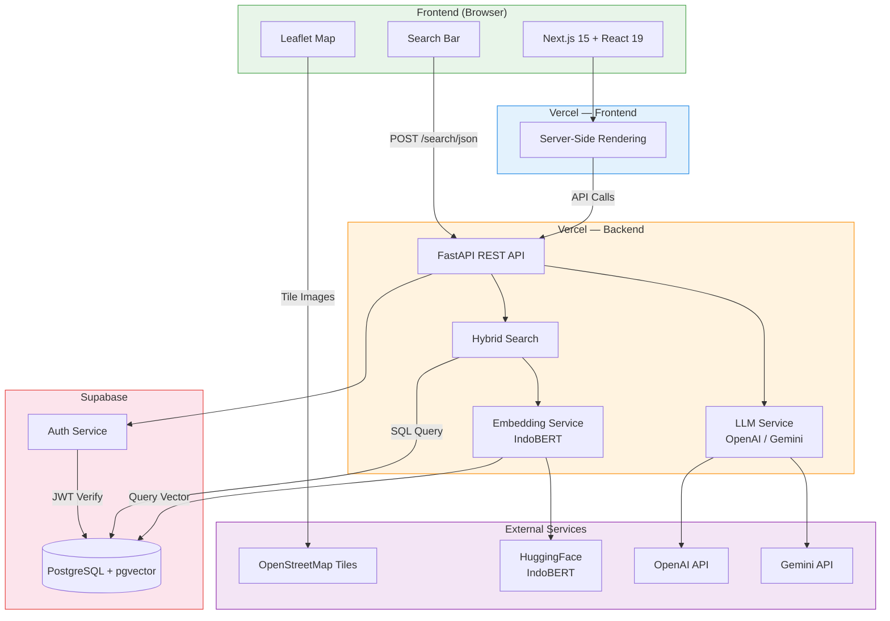
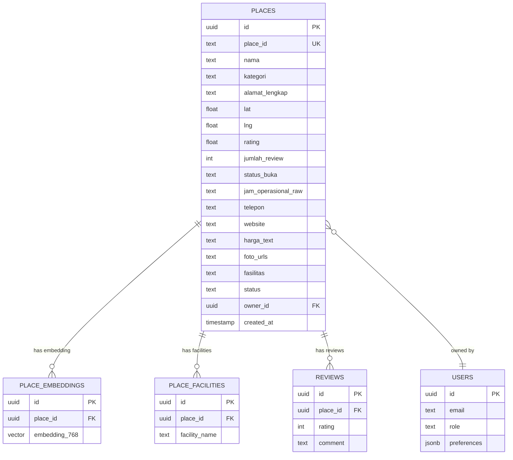
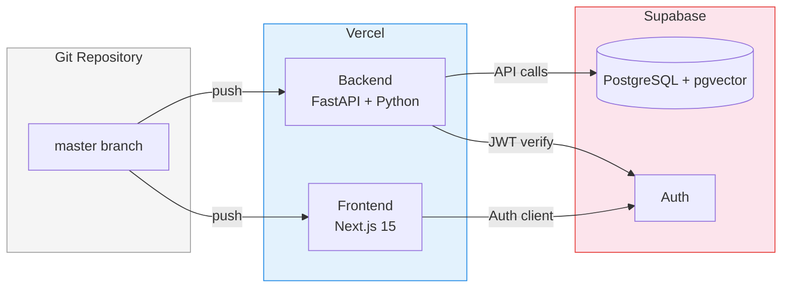

<div align="center">
  
  # RuangSela 
  ### Temukan Ruang, Wujudkan Kegiatan.

  [](https://[URL_DEMO])
  [](https://github.com/sayyidoliem/ruang-sela)
  [](LICENSE)
  
  **Submission for ITECHNO CUP 2026 - Web Development**
  
  **Dibuat untuk mengikuti ITECHNO CUP 2026 sekaligus mengembangkan solusi digital yang dapat membantu masyarakat menemukan dan memanfaatkan ruang secara lebih optimal.**
  
</div>

---

## 📋 Daftar Isi

- [Tentang Proyek](#-tentang-proyek)
- [Fitur Unggulan](#-fitur-unggulan)
- [Demo & Screenshot](#-demo--screenshot)
- [Teknologi](#-teknologi)
- [Arsitektur Sistem](#-arsitektur-sistem)
- [Instalasi & Setup](#-instalasi--setup)
- [Penggunaan](#-penggunaan)
- [API Documentation](#-api-documentation)
- [Testing](#-testing)
- [Tim Developer](#-tim-pengembang)
- [Lisensi](#-lisensi)

---

## 👥 Tim Developer

| Nama | Peran | GitHub |
| ---- | ----- | ------ |
| **Sayyid Muhammad Muslim As'ad Sunarko** | Project Lead & Front-end Developer | [GitHub](https://github.com/sayyidoliem) |
| **Michael Kristianto** | Back-end Developer | [GitHub](https://github.com/emkax) |
| **Muhammad Ryan Apriansyah** | UI/UX Designer & Front-end Developer | [GitHub](https://github.com/ryanocks) |

---

## 🎯 Tentang Proyek

### Latar Belakang

Jakarta merupakan kota dengan aktivitas masyarakat dan komunitas yang sangat beragam, mulai dari kegiatan sosial, pendidikan, kreatif, hingga organisasi. Namun, kebutuhan terhadap ruang yang dapat digunakan untuk berbagai aktivitas tersebut masih menjadi tantangan.

Dinas Perpustakaan dan Kearsipan Provinsi DKI Jakarta menyoroti minimnya ruang publik yang dapat digunakan secara bebas di Jakarta. Ruang publik memiliki peran penting dalam mendukung masyarakat untuk belajar, berkarya, berkolaborasi, serta menjalankan berbagai aktivitas komunitas.

Di sisi lain, persoalan tidak hanya berkaitan dengan jumlah ruang, tetapi juga bagaimana ruang yang tersedia dapat dimanfaatkan secara optimal. Penelitian mengenai taman kota di Jakarta menunjukkan bahwa hanya sebagian kecil taman kota yang dimanfaatkan masyarakat sebagai wadah kegiatan kreatif, sementara sebagian lainnya lebih banyak digunakan untuk aktivitas rekreasi dan berkumpul.

Pemerintah Provinsi DKI Jakarta juga terus mendorong pengembangan dan optimalisasi ruang publik. Luas Ruang Terbuka Hijau (RTH) Jakarta masih berada di sekitar 5,2% dari luas wilayah Jakarta, sementara pemerintah menargetkan peningkatan proporsi RTH hingga 30% pada tahun 2030.

Permasalahan tersebut juga berkaitan dengan visibilitas dan akses informasi mengenai tempat yang tersedia. Masyarakat atau komunitas dapat memiliki kebutuhan terhadap ruang untuk berkegiatan, sementara di sisi lain terdapat berbagai tempat dengan fasilitas dan kapasitas yang berpotensi dimanfaatkan. Namun, informasi mengenai lokasi, fasilitas, kapasitas, harga, ketersediaan jadwal, dan mekanisme pengajuan tempat belum tentu mudah ditemukan dalam satu platform.

### Solusi yang Ditawarkan

**RuangSela** merupakan platform digital yang membantu masyarakat dan komunitas menemukan serta mengajukan penggunaan tempat sesuai dengan kebutuhan kegiatan mereka.

Platform ini menyediakan informasi mengenai:

- 📍 Lokasi tempat
- 👥 Kapasitas
- 🏢 Fasilitas
- 💰 Harga
- 📅 Ketersediaan jadwal
- ⭐ Rating dan ulasan
- 📞 Informasi kontak tempat
- 📝 Mekanisme pengajuan penggunaan tempat

Bagi pengguna, RuangSela mempermudah proses pencarian dan pengajuan tempat tanpa harus mencari informasi dari berbagai sumber secara terpisah.

Sementara bagi pengelola tempat, RuangSela membantu meningkatkan visibilitas tempat yang mereka miliki sehingga lebih mudah ditemukan oleh calon pengguna.

Dengan mempertemukan kebutuhan pengguna dengan tempat yang tersedia, RuangSela bertujuan menciptakan ekosistem pemanfaatan ruang yang lebih mudah diakses, informatif, dan efisien.

### Tujuan Proyek

- 🎯 **Tujuan Utama**: Mempermudah masyarakat dan komunitas dalam menemukan serta mengajukan penggunaan ruang yang sesuai dengan kebutuhan kegiatan mereka.

- 📊 **Target Pengguna**: Masyarakat, mahasiswa, komunitas, organisasi, penyelenggara kegiatan, serta pengelola tempat di wilayah Jakarta.

- 💡 **Value Proposition**: Menyatukan proses pencarian, eksplorasi informasi, pengecekan ketersediaan, dan pengajuan tempat dalam satu platform sehingga ruang yang tersedia menjadi lebih mudah ditemukan dan dimanfaatkan.

---

## ✨ Fitur Unggulan

### Fitur Utama

| Fitur | Deskripsi | Keunggulan |
| ----- | --------- | ---------- |
| **Pencarian Tempat** | Pengguna dapat mencari tempat berdasarkan kebutuhan kegiatan dan informasi tempat. | Mempercepat proses menemukan ruang yang sesuai. |
| **Detail Tempat** | Menampilkan informasi lengkap mengenai tempat, seperti foto, lokasi, kapasitas, fasilitas, harga, jam operasional, dan informasi kontak. | Pengguna dapat memahami kondisi tempat sebelum mengajukan penggunaan. |
| **Jadwal Ketersediaan** | Menampilkan jadwal dan slot waktu yang tersedia pada suatu tempat. | Membantu pengguna mengetahui waktu yang dapat digunakan sebelum melakukan pengajuan. |
| **Pengajuan Tempat** | Pengguna dapat mengajukan penggunaan tempat sesuai tanggal, waktu, dan kebutuhan kegiatan. | Membuat proses pengajuan menjadi lebih terstruktur dan praktis. |
| **Ulasan & Rating** | Pengguna dapat melihat pengalaman pengguna lain melalui rating dan ulasan. | Membantu pengguna mempertimbangkan kualitas tempat sebelum memilih. |
| **Peta & Lokasi** | Menampilkan lokasi tempat dan informasi akses. | Memudahkan pengguna memahami lokasi dan akses menuju tempat. |
| **Manajemen Tempat** | Pengelola dapat mengelola informasi tempat yang mereka daftarkan. | Membantu pengelola menjaga informasi tempat tetap relevan dan mudah ditemukan. |
| **Dashboard Admin** | Admin dapat memantau pengguna, tempat, pengajuan, pendapatan, serta aktivitas platform. | Mempermudah pengelolaan dan pengawasan platform. |

### Fitur Tambahan

- **Rekomendasi Tempat** - Menampilkan tempat yang dapat menjadi pilihan berdasarkan kebutuhan pengguna.
- **Trending Places** - Menampilkan tempat yang sedang banyak dilihat atau diminati.
- **Filter Tempat** - Membantu pengguna mempersempit hasil pencarian berdasarkan kategori dan karakteristik tempat.
- **Status Pengajuan** - Pengguna dapat melihat perkembangan pengajuan mulai dari menunggu hingga selesai.
- **Verifikasi Tempat** - Admin dapat melakukan proses verifikasi terhadap tempat yang didaftarkan oleh pengelola.
- **Verifikasi Pengguna** - Admin dapat memantau dan mengelola status pengguna.
- **Riwayat Pengajuan** - Pengguna dapat melihat seluruh riwayat pengajuan tempat yang pernah dilakukan.
- **Manajemen Fasilitas** - Informasi fasilitas ditampilkan berdasarkan fasilitas yang benar-benar tersedia pada masing-masing tempat.

---

## 📸 Demo & Screenshot

### Live Demo

🔗 **[Kunjungi Website](https://[URL_DEMO])**

> URL demo akan ditambahkan setelah deployment aplikasi tersedia.

### Screenshot Aplikasi

Screenshot aplikasi dapat ditambahkan setelah seluruh halaman utama selesai dan deployment tersedia.

Contoh halaman yang dapat ditampilkan:

- Homepage
- Halaman pencarian tempat
- Detail tempat
- Halaman Pengajuan Saya
- Dashboard Admin
- Halaman Verifikasi Tempat
- Halaman Verifikasi User

### Video Demo

📹 **[Link Video Demo](https://[URL_VIDEO])**

> Link video demo akan ditambahkan setelah video demonstrasi aplikasi tersedia.

---

## 🛠️ Teknologi

### Tech Stack

#### Frontend

```text
Framework    : Next.js
Language     : TypeScript
Styling      : Tailwind CSS
UI           : Custom React Components
Routing      : Next.js App Router

#### Backend


Backend      : Supabase
Database     : PostgreSQL (Supabase)
Authentication: Supabase Auth
API          : Supabase API
Storage : Supabase Storage


#### DevOps & Tools

Version Control : Git & GitHub
Design          : Figma
Development     : Visual Studio Code
Deployment      : Vercel

### Alasan Pemilihan Teknologi

| Teknologi    | Alasan Pemilihan                                                         |
| ------------ | ------------------------------------------------------------------------ |
| **Next JS** | Digunakan sebagai framework utama karena mendukung pengembangan aplikasi web modern dengan routing, rendering, dan struktur project yang terorganisir. |
| **TypeScript** | Membantu meningkatkan type safety dan mengurangi kesalahan saat pengembangan aplikasi. |
| **Tailwind CSS** | Mempermudah pembuatan antarmuka yang konsisten, responsif, dan dapat dikembangkan dengan cepat. |
| **Figma** | Digunakan untuk merancang UI/UX sebelum implementasi ke dalam aplikasi. |
| **Git & GitHub** | Digunakan untuk version control dan memudahkan kolaborasi antar anggota tim. |
| **Vercel** | Digunakan sebagai platform deployment yang terintegrasi dengan workflow Next.js. |
| **Supabase** | Digunakan sebagai backend platform yang menyediakan PostgreSQL database, authentication, storage, serta API sehingga proses pengembangan backend dapat dilakukan secara efisien. |
| **PostgreSQL** | Digunakan sebagai database relasional untuk menyimpan data pengguna, tempat, pengajuan, fasilitas, jadwal, dan ulasan. |


### Dependencies Utama

```json
{
  "name": "itechno-cup-nextjs-starter",
  "version": "1.0.0",
  "private": true,
  "scripts": {
    "dev": "next dev --turbopack",
    "build": "next build",
    "start": "next start",
    "lint": "eslint .",
    "typecheck": "tsc --noEmit",
    "test": "vitest run",
    "test:watch": "vitest",
    "test:e2e": "playwright test",
    "quality": "npm run typecheck && npm run test && npm run build"
  },
  "dependencies": {
    "@hookform/resolvers": "^5.2.1",
    "@supabase/ssr": "^0.7.0",
    "@supabase/supabase-js": "^2.56.1",
    "lucide-react": "^0.542.0",
    "next": "^15.5.2",
    "react": "^19.1.1",
    "react-dom": "^19.1.1",
    "react-hook-form": "^7.62.0",
    "zod": "^4.1.5"
  },
  "devDependencies": {
    "@eslint/eslintrc": "^3.3.1",
    "@playwright/test": "^1.55.0",
    "@tailwindcss/postcss": "^4.1.12",
    "@testing-library/jest-dom": "^6.8.0",
    "@testing-library/react": "^16.3.0",
    "@types/node": "22.20.1",
    "@types/react": "19.2.18",
    "@types/react-dom": "^19.1.9",
    "eslint": "^9.34.0",
    "eslint-config-next": "^15.5.2",
    "jsdom": "^26.1.0",
    "tailwindcss": "^4.1.12",
    "typescript": "5.9.3",
    "vitest": "^3.2.4"
  }
}

```

---

## 🏗️ Arsitektur Sistem

### System Architecture



### Database Schema



### Deployment Architecture



### Folder Structure

```
ruang-sela/
├── front-end/              # Next.js 15 Frontend
│   ├── src/
│   │   ├── app/            # App Router pages
│   │   │   ├── (admin)/    # Admin routes
│   │   │   ├── (manager)/  # Pengelola routes
│   │   │   ├── (public)/   # Public routes (cari, ruang, profil)
│   │   │   ├── (settings)/ # Settings routes
│   │   │   └── (user)/     # User routes
│   │   ├── components/     # Shared UI components
│   │   ├── config/         # Environment config
│   │   ├── features/       # Feature modules (spaces, profiles, admin, etc.)
│   │   └── shared/         # Shared lib (API client, types)
│   ├── public/             # Static assets
│   └── API_REFERENCE.md    # API endpoint reference
│
├── BE/                     # FastAPI Backend
│   ├── app/
│   │   ├── routers/        # API route handlers
│   │   ├── services/       # Business logic (search, LLM, embed)
│   │   ├── middleware/      # Auth middleware
│   │   ├── schemas.py      # Pydantic schemas
│   │   ├── database.py     # Database fetch
│   │   └── config.py       # Settings
│   ├── docs/API.md         # Backend API documentation
│   ├── supabase/           # SQL schema + RPC
│   └── scripts/            # ETL & embedding scripts
│
├── data/                   # Raw scraped data (JSON/CSV)
├── scraper/                # Google Maps Scraper (Playwright)
├── scripts/                # Utility scripts
├── SETUP.md                # Installation & setup guide
├── TECH-STACK.md           # Technology stack documentation
└── README.md               # Project documentation
```

---

## ⚙️ Instalasi & Setup

> Dokumentasi lengkap: [SETUP.md](./SETUP.md)

### Prerequisites

Pastikan Anda telah menginstall:

- **Node.js** >= 18.x
- **npm** >= 9.x
- **Python** >= 3.10
- **pip**
- **Git**

### Quick Start

#### 1️⃣ Clone Repository

```bash
git clone https://github.com/sayyidoliem/ruang-sela.git
cd ruang-sela
```

#### 2️⃣ Setup Frontend

```bash
cd front-end
npm install
cp .env.example .env.local    # lalu edit sesuai kebutuhan
npm run dev
```

Frontend berjalan di `http://localhost:3000`

**Environment Variables Frontend** (`.env.local`):

```env
NEXT_PUBLIC_APP_URL=http://localhost:3000
NEXT_PUBLIC_API_URL=https://ruang-sela-be.vercel.app
```

> **Tanpa setup lengkap?** Frontend tetap berjalan menggunakan backend hosted `ruang-sela-be.vercel.app` — search fallback lokal (keyword scoring), gambar & detail tetap ter-load.

#### 3️⃣ Setup Backend

```bash
cd BE
pip install -r requirements.txt
cp .env.example .env            # lalu edit credential
uvicorn app.main:app --reload --port 8000
```

Backend berjalan di `http://localhost:8000`

**Environment Variables Backend** (`.env`):

```env
SUPABASE_URL=https://your-project.supabase.co
SUPABASE_SERVICE_KEY=eyJhbGci...
SUPABASE_ANON_KEY=eyJhbGci...

# LLM Provider (pilih salah satu)
OPENAI_API_KEY=sk-...          # OpenAI
GEMINI_API_KEY=AIza...         # Google Gemini (fallback)
```

API Docs tersedia di `http://localhost:8000/docs`

#### 4️⃣ Setup Database (Supabase)

1. Buat project di [Supabase](https://supabase.com)
2. Jalankan `BE/supabase/schema.sql` di SQL Editor
3. Jalankan `BE/supabase/rpc.sql` untuk fungsi `hybrid_search`
4. Import data dari `BE/schema/`
5. Generate embedding:
   ```bash
   cd BE
   pip install -r requirements.txt -r requirements.ml.txt
   python scripts/etl_bulk75.py
   python scripts/embed_places.py
   ```

#### 5️⃣ Setup Scraper (Opsional)

```bash
pip install -r requirements.txt -r requirements-scraper.txt
playwright install chromium

# Sampel 5 tempat Jakarta Barat
python -m scraper.main --limit 5 --location "Jakarta Barat"
```

### Commands

| Command | Description |
|---|---|
| `npm run dev` | Frontend development server |
| `npm run build` | Frontend production build |
| `npm run lint` | Frontend linting |
| `npm run typecheck` | Frontend type check |
| `uvicorn app.main:app --reload` | Backend development server |

### Akses Aplikasi

| Service | URL |
|---|---|
| Frontend | http://localhost:3000 |
| Backend API | http://localhost:8000 |
| Backend Docs (Swagger) | http://localhost:8000/docs |

---

## 🚀 Penggunaan

### Menjalankan Aplikasi

```bash
# Development mode
npm run dev

# Production build
npm run build
npm run start

# Run tests
npm run test

# Linting
npm run lint
```

### User Guide

#### Untuk Pengguna Umum

1. **Registrasi/Login**: Membuat akun atau masuk untuk mengakses fitur RuangSela.
2. **Mencari Tempat**: Mencari dan memfilter tempat berdasarkan kebutuhan, kategori, kapasitas, fasilitas, dan harga.
3. **Melihat Detail Tempat**: Melihat foto, lokasi, fasilitas, harga, ketersediaan, dan ulasan tempat.
4. **Mengajukan Tempat**: Memilih tanggal dan waktu yang tersedia kemudian mengirimkan pengajuan penggunaan tempat.
5. **Pengajuan Saya**: Memantau status seluruh pengajuan melalui menu Pengajuan Saya.
6. **Memberikan Ulasan**: Memberikan rating dan ulasan setelah penggunaan tempat selesai.

#### Untuk Manager / Pengelola Tempat

1. **Dashboard & Analitik**: Melihat performa tempat melalui informasi seperti total booking, booking yang diproses, booking disetujui, pendapatan, tingkat penggunaan tempat, dan tren booking.
2. **Mendaftarkan Tempat**: Menambahkan informasi tempat, fasilitas, harga, foto, dan detail lainnya.
3. **Mengelola Tempat**: Memperbarui informasi, fasilitas, harga, dan jam operasional tempat.
4. **Mengatur Ketersediaan**: Mengatur tanggal dan slot waktu yang dapat digunakan oleh pengguna.
5. **Mengelola Pengajuan**: Melihat, menerima, atau menolak pengajuan penggunaan tempat.
6. **Melihat Ulasan**: Memantau rating dan ulasan pengguna terhadap tempat yang dikelola.


#### Untuk Admin

1. **Akses Admin Panel**: Masuk menggunakan akun administrator untuk mengakses dashboard.
2. **Dashboard**: Memantau pengguna, booking, pendapatan, dan status tempat.
3. **Verifikasi Tempat**: Memeriksa dan memverifikasi tempat yang didaftarkan oleh manager.
4. **Verifikasi User**: Mengelola status dan verifikasi akun pengguna.
5. **Monitoring**: Memantau pengajuan, aktivitas platform, dan pendapatan.
---

## 📚 API Documentation

### Base URL

```
Development: http://localhost:3000/api
Production:  https://[domain]/api
```

### Endpoints

#### Authentication

```http
POST /api/auth/register
POST /api/auth/login
POST /api/auth/logout
GET  /api/auth/me
```

#### [Resource 1]

```http
GET    /api/[resource]       # Get all
GET    /api/[resource]/:id   # Get by ID
POST   /api/[resource]       # Create
PUT    /api/[resource]/:id   # Update
DELETE /api/[resource]/:id   # Delete
```

### Example Request

```javascript
// Login
const response = await fetch("/api/auth/login", {
  method: "POST",
  headers: { "Content-Type": "application/json" },
  body: JSON.stringify({
    email: "user@example.com",
    password: "password123",
  }),
});
```

📖 **[Dokumentasi API Lengkap](./docs/API.md)** _(opsional)_

---

## 🧪 Testing

### Running Tests

```bash
# Unit tests
npm run test

# Integration tests
npm run test:integration

# E2E tests
npm run test:e2e

# Test coverage
npm run test:coverage
```

### Test Coverage

```
Statements   : XX%
Branches     : XX%
Functions    : XX%
Lines        : XX%
```

---

## 📄 Lisensi

Proyek ini dilisensikan di bawah [MIT License](LICENSE) - lihat file LICENSE untuk detail lebih lanjut.

---

<div align="center">

**Made with ❤️ by kita ikut lomba ITechnoCup soalnya lagi gabut aja sih for ITECHNO CUP 2026**

</div>